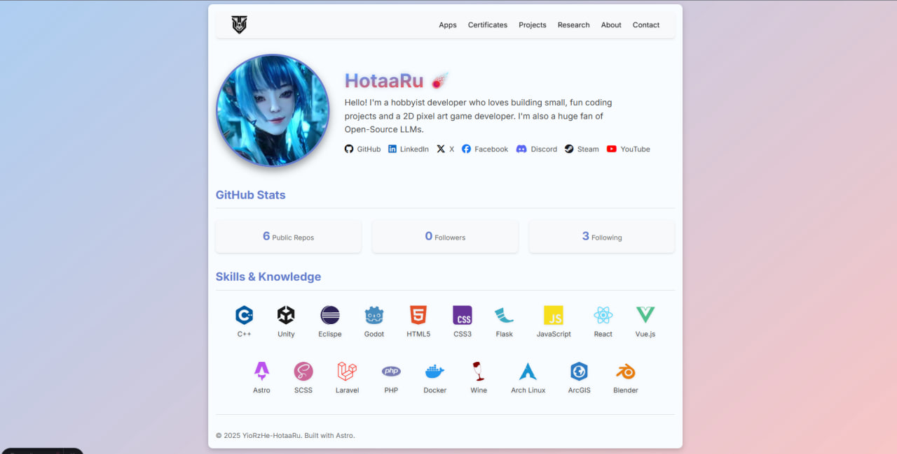
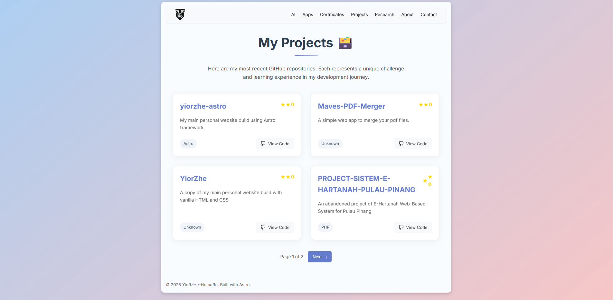
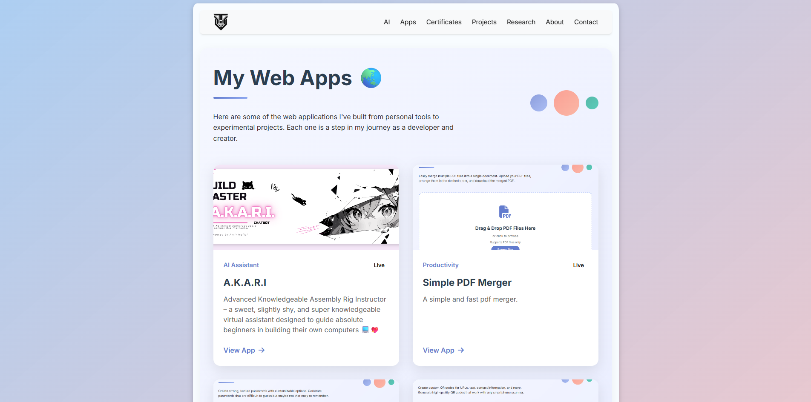

[](https://github.com/YoRzHe-HotaaRu/yiorzhe-astro)
[](LICENSE)
[](https://astro.build)
# YioRzHe-HotaaRu Personal Website 🌐

A clean, modern, and interactive personal website built with **Astro**, showcasing my journey as a hobbyist developer and 2D game creator.

🚀 Live at: [https://yiorzhe.dev](https://yiorzhe.dev)
🔧 Built with: **Astro + SCSS** — no Tailwind, no bloat  
🎮 Focused on: **Hobby coding, 2D games, open-source**

---

## 🎯 Features

- ✅ **GitHub-powered stats** (auto-fetched: repos, followers)
- ✅ **Responsive design** (mobile & desktop friendly)
- ✅ **Dynamic Projects & Apps sections**
- ✅ **Skills & Certificates showcase**
- ✅ **Social links** (GitHub, Discord, Steam, LinkedIn, YouTube)
- ✅ **Clean, custom SCSS styling** — no framework bloat
- ✅ **Interactive hover animations** on cards
- ✅ **Idle float effect** for a dynamic feel

---

## 🛠️ Tech Stack

| Tool       | Purpose                          |
|----------|----------------------------------|
| **Astro** | Fast, static-site framework      |
| **SCSS**  | Custom styling, no utility CSS   |
| **GitHub API** | Fetch real profile data     |
| **Font Awesome** | Icons for social links  |
| **Simple Icons** | Skill logos (CDN)       |

---

## 📸 Screenshots

### Homepage


### Projects Page


### Apps Page



---

## 🚀 Run Locally

1. Clone the repo:
   ```bash
   git clone https://github.com/YoRzHe-HotaaRu/yiorzhe.git
   cd yiorzhe
2. Install dependencies:
   ```bash
    npm install
3. Start dev server:
   ```bash
   npm run dev
4. Open http://localhost:4321
