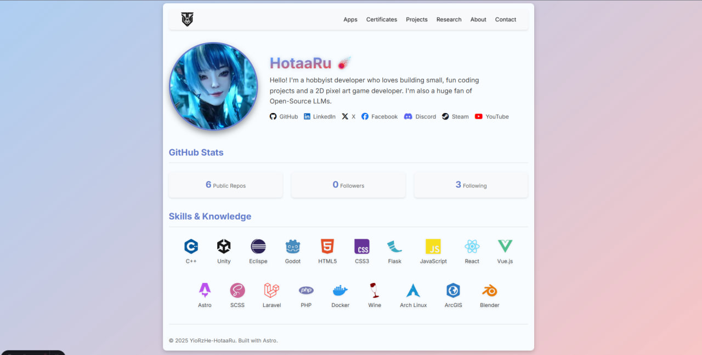
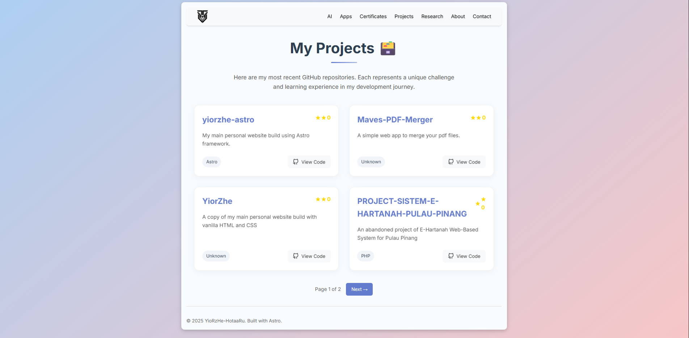
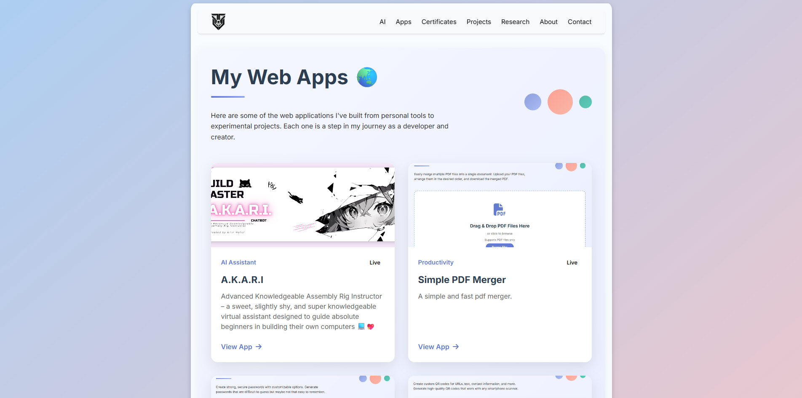

[](https://github.com/YoRzHe-HotaaRu/yiorzhe-astro)
[](LICENSE)
[](https://astro.build)

# YioRzHe-HotaaRu Personal Website 🌐

A clean, modern, and interactive personal website built with **Astro**, showcasing my journey as a hobbyist developer, 2D game creator, and researcher.

🚀 **Live at:** [https://yiorzhe.dev](https://yiorzhe.dev)  
🔧 **Built with:** **Astro + SCSS** — no Tailwind, no bloat  
🎮 **Focused on:** **Hobby coding, 2D games, open-source, research**

---

## 🎯 Features

- ✅ **GitHub-powered stats** — Auto-fetched repos, followers, and profile data
- ✅ **Responsive design** — Mobile & desktop friendly with hamburger menu
- ✅ **Dynamic Projects section** — Fetches GitHub repositories with pagination
- ✅ **Web Apps showcase** — Featured projects & simple utility tools
- ✅ **Research papers section** — Downloadable academic papers with categories
- ✅ **Certificates showcase** — Professional certifications with PDF links
- ✅ **Tools & Resources** — Curated AI and Game Development resources
- ✅ **Favorites section** — Personal games, shows, songs, and artwork collections
- ✅ **Custom 404 page** — Animated Duolingo-style owl character
- ✅ **Clean, custom SCSS styling** — No framework bloat
- ✅ **Interactive hover animations** on cards
- ✅ **Security headers** — CSP, HSTS, XSS protection configured

---

## 🗂️ Project Structure

```
├── src/
│   ├── components/          # Reusable Astro components
│   │   └── Welcome.astro
│   ├── layouts/             # Page layouts
│   │   ├── BaseLayout.astro # Main layout with navigation
│   │   └── Layout.astro
│   ├── pages/               # All website pages
│   │   ├── index.astro      # Homepage with GitHub stats
│   │   ├── about.astro      # About me + favorites
│   │   ├── projects.astro   # GitHub projects with pagination
│   │   ├── apps.astro       # Apps directory
│   │   ├── apps/
│   │   │   ├── featured.astro    # Featured projects (A.K.A.R.I, YuGiDex, etc.)
│   │   │   ├── simple.astro      # Simple tools (PDF Merger, Password Gen, QR Gen)
│   │   │   ├── passwordGen.astro # Password generator tool
│   │   │   ├── pdfMerger.astro   # PDF merger tool
│   │   │   ├── qr-generator.astro # QR code generator
│   │   │   └── ssmaker.astro     # Screenshot maker
│   │   ├── research.astro   # Research papers showcase
│   │   ├── certificates.astro # Certifications display
│   │   ├── tools.astro      # Tools & resources hub
│   │   ├── ai.astro         # AI resources collection
│   │   ├── gamedev.astro    # Game development tools
│   │   ├── contact.astro    # Contact page
│   │   ├── 404.astro        # Custom 404 error page
│   │   ├── favorites/       # Favorites subpages
│   │   │   ├── artwork.astro
│   │   │   ├── game.astro
│   │   │   ├── show.astro
│   │   │   └── song.astro
│   │   └── projects/        # Project pagination
│   │       └── page/
│   │           ├── 2.astro
│   │           ├── 3.astro
│   │           └── 4.astro
│   ├── styles/
│   │   └── main.scss        # Global styles
│   └── env.d.ts
├── public/                  # Static assets
│   ├── assets/
│   │   ├── apps/           # App screenshots
│   │   ├── cert/           # Certificate PDFs
│   │   ├── logo/           # Logo images (OpenAI, OpenClaw, Kilo Code, Qwen)
│   │   └── papers/         # Research papers
│   └── favicon.svg
├── screenshots/            # README screenshots
├── astro.config.mjs        # Astro configuration with security headers
├── package.json
├── tsconfig.json
└── README.md
```

---

## 🛠️ Tech Stack

| Tool | Purpose |
|------|---------|
| **Astro** | Fast, static-site framework |
| **SCSS** | Custom styling with Sass features |
| **TypeScript** | Type-safe JavaScript |
| **GitHub API** | Fetch real profile and repository data |
| **Font Awesome** | Icons for social links and UI |
| **Simple Icons** | Skill/technology logos (CDN) |
| **Google Fonts** | Inter font family |

---

## 📸 Screenshots

### Homepage


### Projects Page


### Apps Page


---

## 🚀 Run Locally

1. **Clone the repo:**
   ```bash
   git clone https://github.com/YoRzHe-HotaaRu/yiorzhe.git
   cd yiorzhe
   ```

2. **Install dependencies:**
   ```bash
   npm install
   ```

3. **Start dev server:**
   ```bash
   npm run dev
   ```

4. **Open** [http://localhost:4321](http://localhost:4321)

---

## 📦 Build for Production

```bash
npm run build
```

The static site will be generated in the `dist/` directory.

---

## 🔒 Security Features

The site includes comprehensive security headers configured in [`astro.config.mjs`](astro.config.mjs):

- **Strict-Transport-Security (HSTS)** — Forces HTTPS
- **Content-Security-Policy (CSP)** — Prevents XSS attacks
- **X-Frame-Options** — Prevents clickjacking
- **X-Content-Type-Options** — Prevents MIME sniffing
- **Referrer-Policy** — Controls referrer information
- **Permissions-Policy** — Restricts browser features
- **X-XSS-Protection** — Additional XSS protection

---

## 🎨 Design Philosophy

- **Intentional Minimalism** — Clean layouts with purposeful elements
- **Custom SCSS** — No utility CSS frameworks, handcrafted styles
- **Responsive First** — Mobile-friendly with breakpoints at 768px and 480px
- **Interactive Elements** — Hover effects, animations, and micro-interactions
- **Accessibility** — Semantic HTML and proper ARIA labels

---

## 📝 Pages Overview

| Page | Description |
|------|-------------|
| **Home** | GitHub profile, stats, skills showcase |
| **About** | Personal bio, skills, favorites (games, shows, songs, artwork) |
| **Projects** | GitHub repositories with pagination (4 per page) |
| **Apps** | Web applications directory (Featured + Simple tools) |
| **Research** | Academic papers with download links |
| **Certificates** | Professional certifications |
| **Tools** | Curated AI and Game Development resources |
| **Contact** | Email, Discord, GitHub contact methods |

---

## 🤝 Connect

- **GitHub:** [@YoRzHe-HotaaRu](https://github.com/YoRzHe-HotaaRu)
- **LinkedIn:** [Amir Hafizi Musa](https://linkedin.com/in/amir-hafizi-musa-5530b9364)
- **Discord:** [Profile](https://discord.com/users/330997221334056971)
- **Steam:** [amirhafizi177013](https://steamcommunity.com/id/amirhafizi177013)
- **YouTube:** [@VectorVulKan727](https://youtube.com/@VectorVulKan727)

---

## 📄 License

MIT License — feel free to use this as a template for your own portfolio!

---

*Built with ❤️ by [YioRzHe-HotaaRu](https://github.com/YoRzHe-HotaaRu)*
